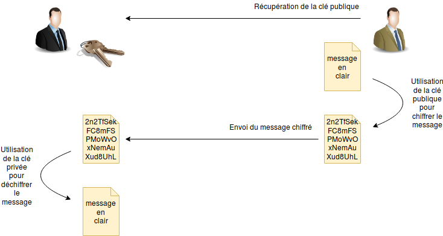

Utilisation de GnuGPG
===


# Simple représentation

Simple schéma de représentation d'un échange de message chiffré entre deux personnes.



# Signature

Il est possible de signer un message chiffré avec sa propre clé publique pour authentifier le message et ainsi prouver son authenticité. La clé publique utilisée doit néanmoins être connue par le destinataire du message chiffré signé pour avoir une utilité.

# Création d'une clé

```sh
gpg2 --full-gen-key
```
Il est possible de choisir les algorithmes de chiffrement pour les deux clés:

1) RSA et RSA (par défaut)
2) DSA et Elgamal
3) DSA (signature seule)
4) RSA (signature seule)

Je recommande de choisir entre (1) et (2).

Choisir au minimum une taille de clé de 3072 pour une recommandation d'au delà 2030.

Les clés sont stockées sous ~/.gnupg. Pour visualiser les clés enregistrées, il faut faire:

```sh
gpg2 --list-keys
```

pour les clés publiques et 

```sh
gpg2 --list-secret-keys
```

pour les clés privées.

# Édition d'une clé

Pour éditer une clé

```sh
gpg2 --edit-key [info_clé]
```

où info clé est l'identifiant permettant de distribuer la clé sans ambiguïté.

Ensuite, il est possible d'utiliser la commande:

```sh
showpref
```

pour afficher les informations de la clé et

```sh
check
```

pour vérifier la clé

pour vérifier l'empreinte de la clé et ainsi s'assurer de la bonne conformité de la clé:

```sh
fpr
```

en cas d'ultime confiance, il est possible de signer la clé pour ainsi assurer à d'autres utilisateurs que la clé est valide et n'est pas une fasse clé:

```sh
sign
```

pour faire confiance à la clé:

```sh
trust
```

ensuite il est recommandé de donner une niveau de sûreté. Si vous connaissez la personne et que vous êtes sur de la conformité de la clé, utilisé 4. 5 est uniquement dans le cas où on possède la clé privée.

puis pour quitter l'édition de la clé:

```sh
save
```

# Signatures d'une clé

Pour afficher toutes les signatures de toutes les clés du trousseau:

```sh
gpg2 --check-sigs
```

# Révocation de clé

Pour révoquer la clé en cas de faille ou de doute, il est préférable de générer un certificat de révocation puis de le stocker sur un autre support que celui où se trouve la clé privée.

```sh
gpg2 --output revok_cle.asc --gen-revoke [info-cle]
```

# Import de clé

Pour importer une clé, il faut utiliser la commande suivante:

```sh
gpg2 --import cle.asc
```

# Export de clé

Pour exporter une clé :

```sh
gpg2 --output macle.asc --armor --export [info-cle]
```

# Chiffrer et signer un message

Pour chiffrer un message:

```sh
gpg2 --encrypt --armor --recipient [info-cle] [document_clair]
```

Cette commande donne un document [document_chiffre].asc

Pour signer un document chiffré :

```sh
gpg2 --armor --output [document_signe].sig --sign [document_chiffre].asc
```

# Déchiffrer un message

Pour déchiffrer un message, on utilise simplement la commande:

```sh
gpg2 [document_chiffre]
```

Si le document est signé, il indiquera (si on connait la signature, après avoir importé la clé publique de la source) qui est le signataire et fournira un message à déchiffrer. Il faudra retapper la même commande pour déchiffrer le message.

# Ma clé publique

Ma clé publique est disponible à l'emplacement [Corentin.asc](Corentin.asc), vous pouvez m'envoyer un email chiffré à leguen.corentin@mail.com.
